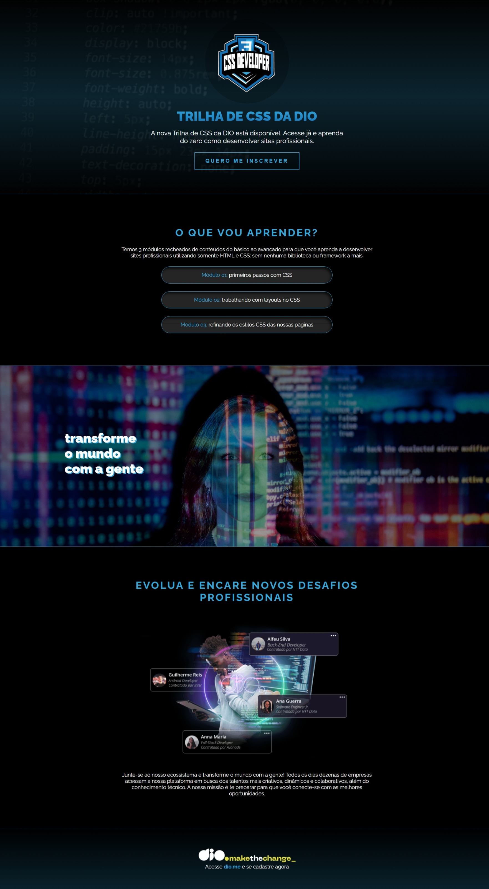

# Desafio Trilha CSS - DIO

Este projeto faz parte da **Trilha de CSS** da [DIO.me](https://dio.me), onde o desafio principal foi **estilizar um site utilizando apenas CSS puro**. O HTML base foi fornecido no repositório original e aqui foi mantido sem alterações. Toda a customização visual foi feita exclusivamente via CSS.

## Sobre o projeto

O objetivo deste desafio é aplicar na prática os conceitos fundamentais de CSS, como:

-   Seletores e hierarquia;
-   Cores, fontes e espaçamentos;
-   Layout com `flexbox`;
-   Gradientes e sobreposição de camadas (`background-image`);
-   Imagens de fundo fixas e responsividade simples.

> O HTML foi mantido como no repositório original. Todo o trabalho realizado neste repositório está concentrado no arquivo `style.css`.

## Funcionalidades e características

-   Estilização completa da landing page com:
    -   Banner com gradiente e imagem de fundo.
    -   Tipografia personalizada com Google Fonts.
    -   Cards de módulos com efeito de sombra.
    -   Sessão com imagem de fundo fixa.
    -   Responsividade básica para diferentes tamanhos de tela.
    -   Botões estilizados com borda gradiente.

## Captura de Tela

## Tecnologias Utilizadas

-   HTML5 (fornecido pela DIO)
-   CSS3
-   Google Fonts

## Repositório Original (Fork)

Este projeto é um fork do repositório oficial da DIO:  
[https://github.com/digitalinnovationone/trilha-css-desafio-01](https://github.com/digitalinnovationone/trilha-css-desafio-01)

## Autor

Desenvolvido por **Junior Costa**.  
Conecte-se comigo: [linkedin.com/in/seu-perfil](www.linkedin.com/in/junior-costa-franca)

---

> Projeto desenvolvido como parte da jornada de aprendizado em Front-End com foco em CSS.
